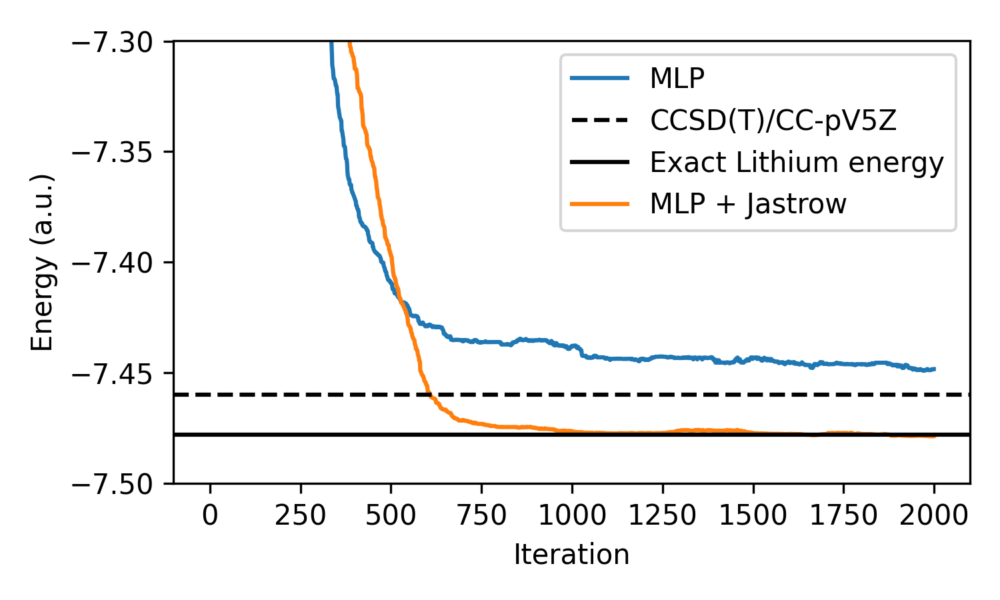

# Neural Variational Monte Carlo - Jax

Implementation of variational Monte Carlo in JAX, along with a simple neural network Ansatz, `PsiMLP`.

For more details please refer to my blog post, [Neural Variational Monte Carlo](https://teddykoker.com/2024/11/neural-vmc-jax/).

## Usage

### Dependencies

Environment can be created very quickly with [uv](https://github.com/astral-sh/uv):

```bash
pip install uv
uv sync
source .venv/bin/activate
```

### Blog

The file `extra/blog/blog.py` contains all the code to reproduce the original [blog post](https://teddykoker.com/2024/11/neural-vmc-jax/), and can be run with:

```bash
cd extra/blog
python blog.py
```

